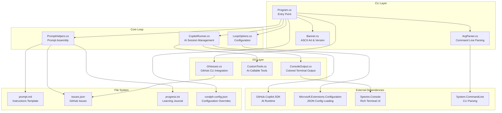
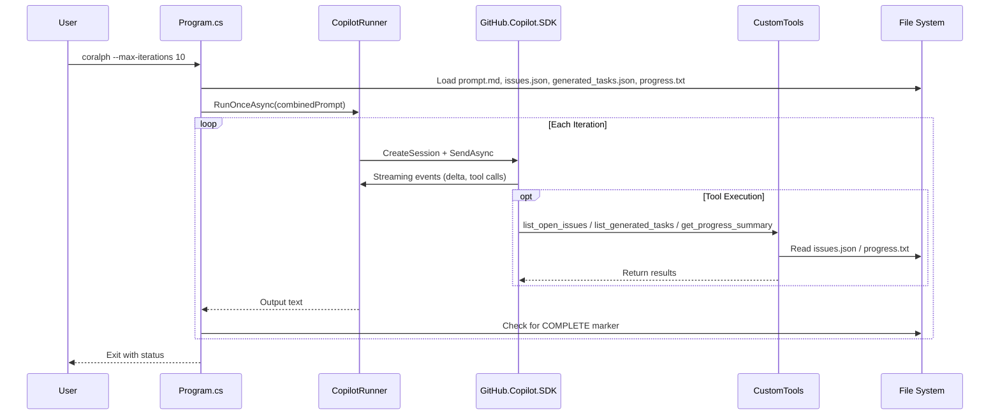

# Coralph Architecture

This document describes the high-level architecture of Coralph, an AI-powered development loop runner.

## Overview

Coralph is a .NET CLI application that orchestrates automated development workflows by:
1. Reading GitHub issues and a prompt template
2. Running an AI assistant (via GitHub Copilot SDK) in a loop
3. Allowing the assistant to make changes, run tests, and commit code
4. Tracking progress across iterations

## Architecture Diagram

## Component Descriptions

### CLI Layer

| Component | Responsibility |
|-----------|----------------|
| **Program.cs** | Entry point, orchestrates the main loop, handles initialization and shutdown |
| **ArgParser.cs** | Parses command-line arguments using System.CommandLine |
| **Banner.cs** | Displays animated ASCII banner and version information |

### Core Loop

| Component | Responsibility |
|-----------|----------------|
| **LoopOptions.cs** | Configuration model (max iterations, model, file paths, etc.) |
| **PromptHelpers.cs** | Combines prompt template with issues and progress into a single prompt |
| **CopilotRunner.cs** | Manages AI session lifecycle, handles streaming events and tool execution |

### I/O Layer

| Component | Responsibility |
|-----------|----------------|
| **ConsoleOutput.cs** | Provides colored/styled console output with Spectre.Console |
| **CustomTools.cs** | Exposes AI-callable functions (list_open_issues, list_generated_tasks, get_progress_summary, search_progress) |
| **GhIssues.cs** | Fetches issues from GitHub using `gh` CLI |

## Data Flow

## External Dependencies

| Package | Version | Purpose |
|---------|---------|---------|
| **GitHub.Copilot.SDK** | 0.1.18 | AI runtime for Copilot integration |
| **Microsoft.Extensions.Configuration.Json** | 8.0.0 | Load configuration from JSON files |
| **Microsoft.Extensions.Options.ConfigurationExtensions** | 8.0.0 | Bind configuration to options classes |
| **Spectre.Console** | 0.49.1 | Rich terminal output (colors, styling) |
| **System.CommandLine** | 2.0.0-beta4 | CLI argument parsing and help generation |

## File Dependencies

| File | Purpose | Required |
|------|---------|----------|
| `prompt.md` | Instructions template for the AI assistant | Yes |
| `issues.json` | GitHub issues to process (can be refreshed with `--refresh-issues`) | Yes (can be empty `[]`) |
| `generated_tasks.json` | Persisted task backlog generated from issues | No (created if missing) |
| `progress.txt` | Learning journal tracking completed work | No (created if missing) |
| `coralph.config.json` | Configuration overrides | No (uses defaults) |

## Key Design Decisions

1. **Streaming Architecture**: Uses event-based streaming from GitHub.Copilot.SDK for real-time output
2. **Tool Extensibility**: Custom AI tools exposed via `AIFunctionFactory.Create()` pattern
3. **Configuration Layering**: CLI args override config file, which overrides defaults
4. **Progress as Learning Journal**: Assistant writes structured summaries with learnings, not raw output
5. **Early Exit on COMPLETE**: Loop terminates when assistant outputs completion marker
